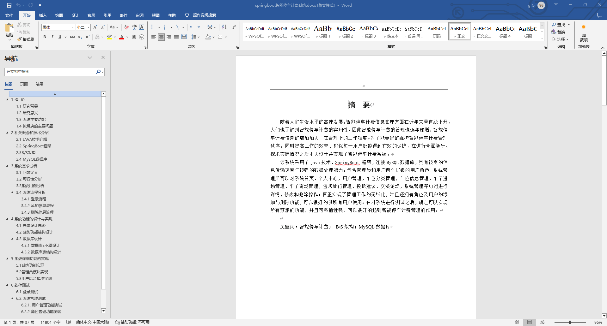
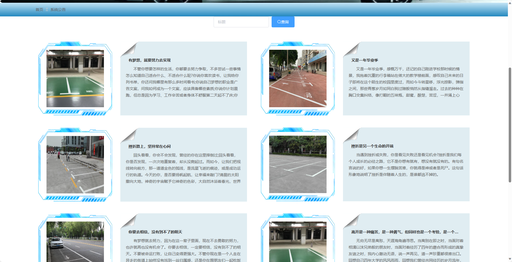
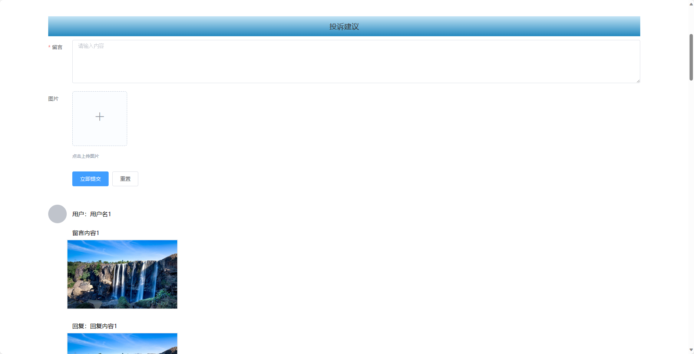
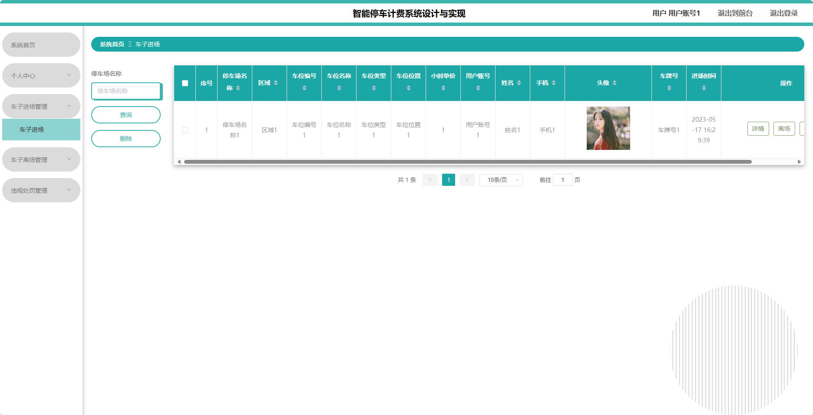
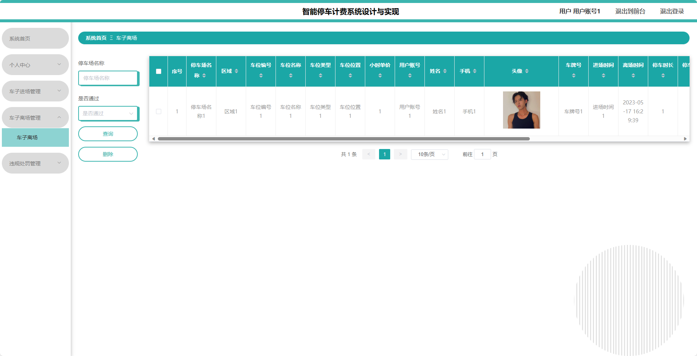
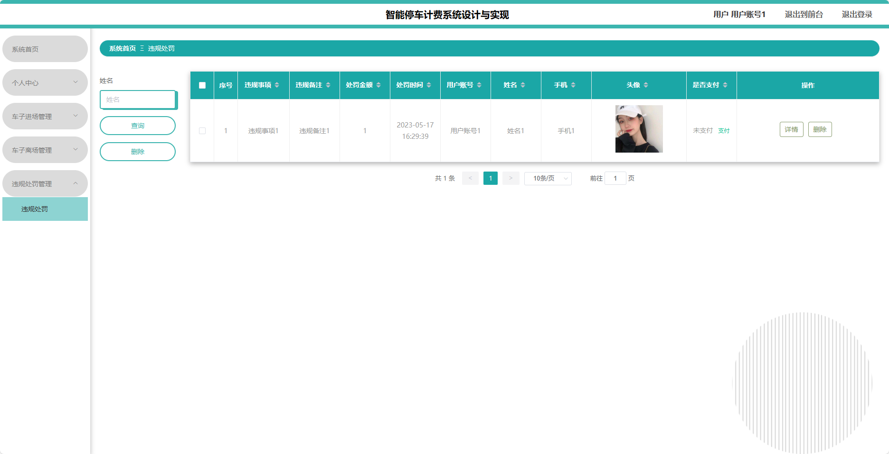
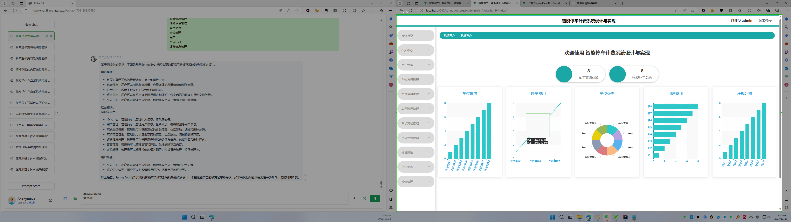
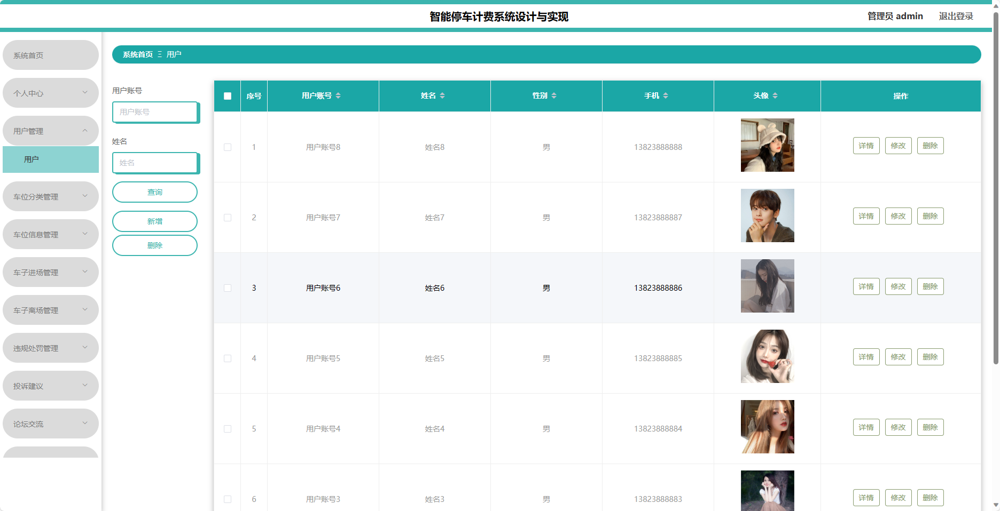

## 基于SpringBoot的智能停车计费系统(程序+报告)

###  获取sql数据库文件: 从戎源码网 (https://armycodes.com/) QQ: 386869957 QQ群: 377586148
###  所有系统地址: (https://github.com/YuLin-Coder/AllProjectCatalog) 
###  所有项目以及源代码本人均调试运行无问题 可支持远程安装部署调试、定制修改、代码讲解

## 项目介绍
基于SpringBoot的智能停车计费系统，系统包含两种角色：管理员、用户,系统分为前台和后台两大模块，主要功能如下。

### 【管理员】:
- 个人中心：管理员可以管理个人信息，修改密码等。
- 用户管理：管理员可以管理用户信息，包括添加、编辑和删除用户信息。
- 车位分类管理：管理员可以管理车位分类信息，包括添加、编辑和删除分类。
- 车位信息管理：管理员可以管理车位的信息，包括添加、编辑和删除车位。
- 车子进场管理：管理员可以管理车辆进场情况，包括车牌号、进场时间、停车位置等信息。
- 车子离场管理：管理员可以管理车辆离场情况，包括车牌号、离场时间、停车费用等信息。
- 违规处罚管理：管理员可以管理停车场内的违规行为，包括违停、乱扔垃圾等。
- 投诉建议：管理员可以管理投诉建议板块，包括处理投诉、回复用户等。
- 论坛交流：管理员可以管理论坛板块，包括审核话题、回复用户等。

### 【用户】:
- 个人中心：用户可以管理个人信息，包括修改密码、查看停车历史等。
- 车子进场管理：用户可以登记车辆进场信息，包括车牌号、进场时间等。
- 车子离场管理：用户可以登记车辆离场信息，包括车牌号、离场时间等。
- 违规处罚管理：用户可以查看自己的违规记录及相应处罚情况。

### 【前台】:
- 首页：展示平台的最新动态、车位信息等内容。
- 车位信息：用户可以查看各类车位的位置、空闲情况、停车费用及限制条件等信息。
- 论坛交流：用户可以在论坛上进行交流。
- 公告：展示平台发布的公告和通知信息。
- 投诉建议：用户可以在投诉建议板块上对停车场内发生的问题或提出改进意见。
- 在线交流：用户可以通过在线聊天室与管理人员进行在线咨询。
- 个人中心：用户可以管理个人信息，包括修改密码、查看停车历史等。

## 项目技术
- 编程语言：Java
- 数据库：MySQL
- 项目管理工具：Maven
- 前端技术：HTML、CSS、JavaScript、Jquery、Vue
- 后端技术：Spring、SpringMVC、MyBatis

## 运行环境
- JDK版本：JDK1.8及以上
- 开发工具：IDEA、Ecplise、Myecplise都可以
- 数据库: MySQL5.7及以上
- Maven：maven3.0及以上
- Node：14.14.0及以上

## 运行截图

